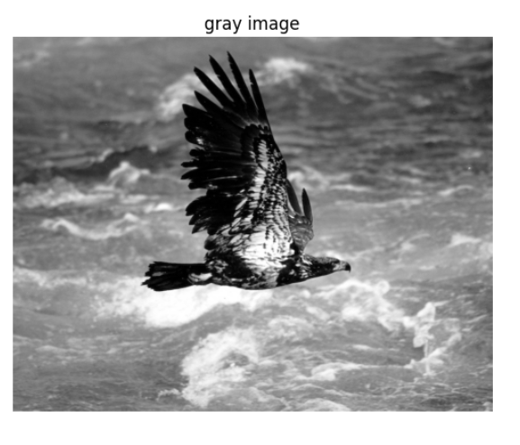
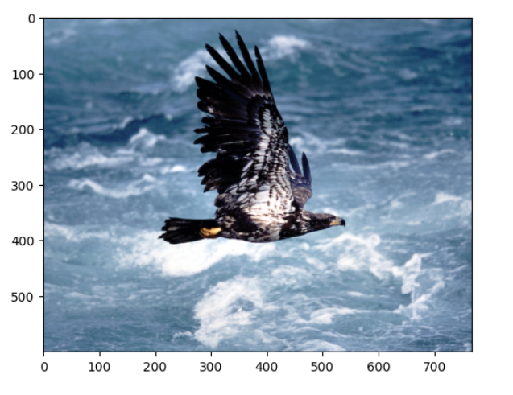
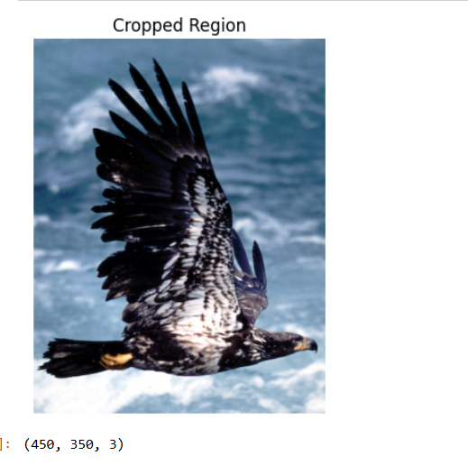
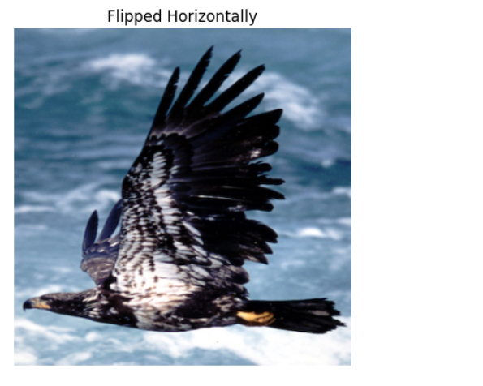
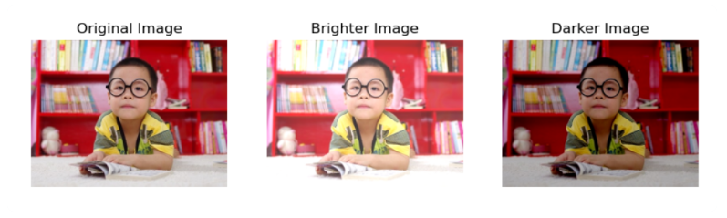
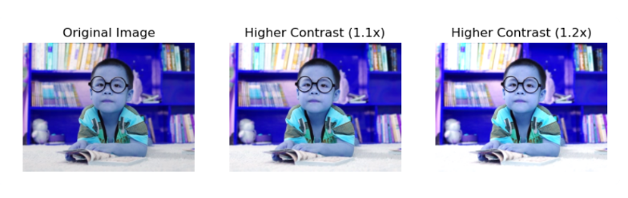
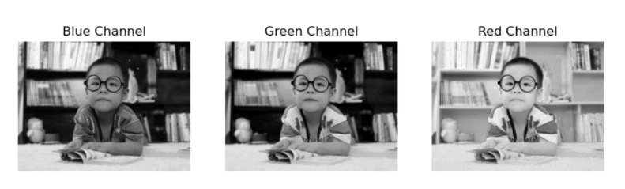
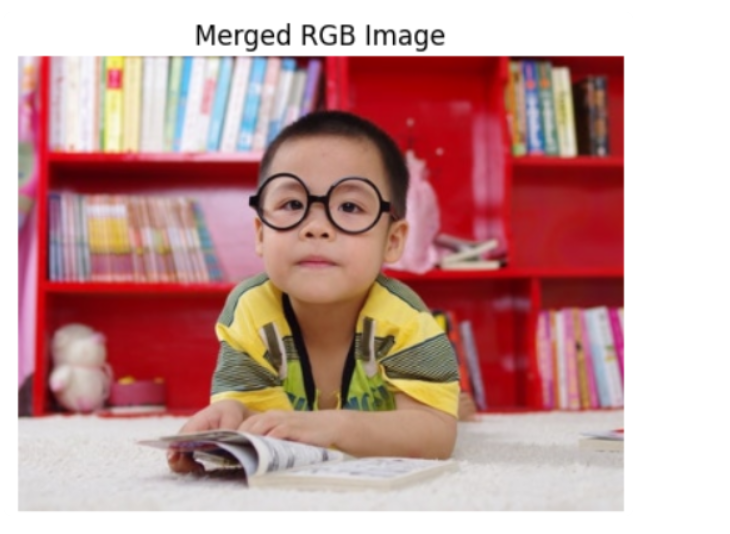
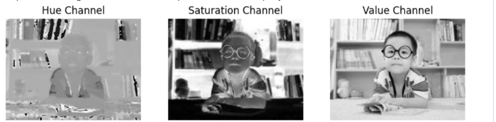
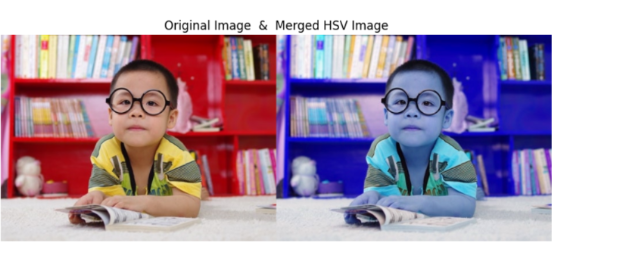

# PixelPlay: Image Contrast Explorer

A simple image processing project using Python and OpenCV to understand and visualize **brightness and contrast adjustments**.

---

## Project Description

This project demonstrates how to:
- Load and display an image
- Adjust **lower contrast**
- Adjust **higher contrast**
- Compare results visually using matplotlib

---

## Technologies Used

- Python 🐍
- OpenCV (cv2)
- NumPy
- Matplotlib

---

## Features

✅ Display Original Image  
✅ Generate Lower Contrast Image  
✅ Generate Higher Contrast Image  
✅ Side-by-side comparison  

---

## Concept

- **Brightness** → Adds light to the image  
- **Contrast** → Enhances difference between light and dark areas  

---

## How It Works

1. Read the image using OpenCV
2. Convert image to RGB (for correct display)
3. Apply contrast scaling:
   - Lower Contrast → multiply by value < 1
   - Higher Contrast → multiply by value > 1
4. Display all images using matplotlib

---

## Sample Code

```python
import cv2
import numpy as np
import matplotlib.pyplot as plt

img = cv2.imread("image.jpg")
img_rgb = cv2.cvtColor(img, cv2.COLOR_BGR2RGB)

# Lower and Higher contrast
img_lower = (img_rgb * 0.7).clip(0,255).astype("uint8")
img_higher = (img_rgb * 1.3).clip(0,255).astype("uint8")

plt.figure(figsize=(10,5))

plt.subplot(131)
plt.imshow(img_rgb)
plt.title("Original")
plt.axis("off")

plt.subplot(132)
plt.imshow(img_lower)
plt.title("Lower Contrast")
plt.axis("off")

plt.subplot(133)
plt.imshow(img_higher)
plt.title("Higher Contrast")
plt.axis("off")

plt.show()
```
## Output

### Read and Display an Image.


a.Save image as PNG and display:


b.Cropped image


c.Resize and flip Horizontally:


### Adjust Image Brightness.

a.Create brighter and darker images and display:


### Modify Image Contrast.

a.Modify contrast using scaling factors 1.1 and 1.2


### Generate Third Image Using Bitwise Operations.

a.Split 'Boy.jpg' into B, G, R components and display:


b.Merge the R, G, B channels and displayd.


c.Split the image into H, S, V components and display:


d.Merge the H, S, V channels and display:



## Result

Thus, the images were read, displayed, brightness and contrast adjustments were made, and bitwise operations were performed successfully using the Python program.